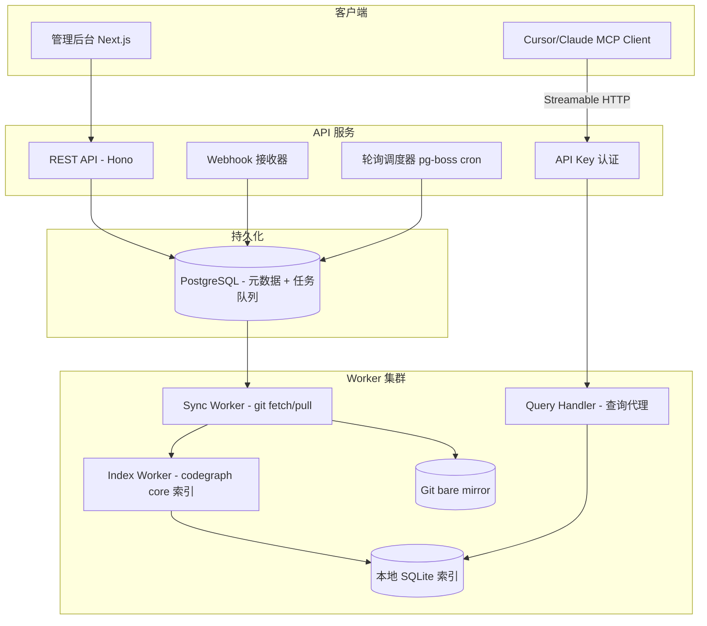

# CodeGraph Cloud 优化架构方案

## 一、对 Cursor Plan 的核心优化点

### 1. 索引引擎：Fork codegraph 核心而非自研

Cursor Plan 选择"借鉴 schema 从零自研"，**优化方案：直接 fork codegraph 核心模块到 `packages/core`**。

理由：
- codegraph 已有完整的 extraction/resolution/graph/context 管道，覆盖 20+ 语言和框架
- Fork 后可以立即获得全量语言支持，MVP 不需要限制在 3 种语言
- 需要改造的部分相对集中：去掉 `fs.watch`/stdio/daemon 等本地逻辑，适配远程调用接口
- 后续 codegraph 上游更新可选择性 merge

**Fork 范围**（从 `codegraph/src/` 提取）：
- `extraction/` -> `packages/core/extraction/`（tree-sitter 提取、parse-pool、语言提取器）
- `resolution/` -> `packages/core/resolution/`（跨文件引用解析、框架路由）
- `graph/` -> `packages/core/graph/`（图遍历、查询）
- `context/` -> `packages/core/context/`（上下文组装）
- `db/` -> `packages/core/db/`（SQLite schema + queries）
- `search/` -> `packages/core/search/`（FTS 查询解析）

**需要剥离/改造的部分**：
- `sync/watcher.ts` 中的 `fs.watch` 逻辑 -> 替换为 API 驱动的增量同步
- `mcp/` 整个目录 -> 不 fork，云端重新实现 HTTP MCP 层
- `bin/` CLI 入口 -> 不 fork，云端用 Worker 入口替代
- `directory.ts` 中的本地目录检测 -> 替换为 Git workspace 路径管理

### 2. 基础设施精简

Cursor Plan 用了 PostgreSQL + Redis + BullMQ + S3 四个组件。**优化方案**：

| 组件 | Cursor Plan | 优化方案 | 理由 |
|------|------------|---------|------|
| 元数据库 | PostgreSQL | **PostgreSQL**（保留） | 多租户、事务、JSONB 配置存储需要关系型 DB |
| 任务队列 | BullMQ + Redis | **PostgreSQL 任务表 + pg-boss** | 中等规模不需要独立 Redis；pg-boss 基于 PG 表实现任务队列，支持重试/延迟/优先级，少一个基础设施 |
| 对象存储 | S3/MinIO | **本地持久卷 + Git bare mirror** | 索引 SQLite 文件直接存在 Worker 持久卷；Git mirror 用 bare repo 而非 S3 对象 |
| 索引缓存 | S3 + LRU 本地缓存 | **Worker 本地 SQLite + 查询节点内存缓存** | 索引文件不频繁变动，Worker 索引完直接保留本地，查询节点按需加载 |

**优化后的基础设施**：只需 **PostgreSQL + Docker Compose**，不需要 Redis 和 MinIO。

### 3. 索引存储架构重新设计

Cursor Plan 的 `S3 -> 下载 -> 本地缓存` 模式在大项目场景下有性能问题。

**优化方案：索引文件本地持久化 + 版本化**

```
Worker 节点本地存储：
/data/indexes/{project_id}/current/codegraph.db   <- 当前索引
/data/indexes/{project_id}/archive/{commit_sha}/   <- 历史版本（可选）

查询节点：
- 直接挂载同一持久卷（单机部署）
- 或通过 gRPC/HTTP 访问 Worker 的查询接口（分布式部署）
```

优势：
- 避免大文件频繁 S3 上传下载
- SQLite WAL 模式支持读写并发
- 增量索引直接在本地 DB 上操作，无需下载-修改-上传

### 4. 查询架构优化

Cursor Plan 的查询路径是 `MCP -> 下载 SQLite -> 本地查询`。

**优化方案：查询代理模式**

```
MCP HTTP Server -> Query Router -> 项目对应的 Worker 实例
                                    -> Worker 内嵌的 CodeGraph 实例直接查询
```

每个 Worker 既负责索引，也负责查询。Worker 维护已索引项目的 SQLite 连接池。MCP Server 根据 project_id 路由到正确的 Worker。

---

## 二、优化后的架构



---

## 三、优化后的 Monorepo 结构

```
codegraph-cloud/
├── apps/
│   ├── api/                        # REST API + Webhook + 调度
│   │   ├── src/
│   │   │   ├── routes/
│   │   │   │   ├── projects.ts     # 项目 CRUD
│   │   │   │   ├── webhooks.ts     # GitLab/GitHub Webhook 接收
│   │   │   │   ├── api-keys.ts     # API Key 管理
│   │   │   │   └── sync.ts         # 手动触发同步
│   │   │   ├── services/
│   │   │   │   ├── project.service.ts
│   │   │   │   ├── webhook.service.ts  # Webhook 签名验证 + 事件去重
│   │   │   │   ├── scheduler.service.ts # pg-boss 定时任务
│   │   │   │   └── auth.service.ts     # API Key 校验
│   │   │   ├── middleware/
│   │   │   │   └── auth.ts
│   │   │   └── index.ts
│   │   └── package.json
│   │
│   ├── mcp-server/                 # MCP HTTP 服务（独立进程）
│   │   ├── src/
│   │   │   ├── transport/
│   │   │   │   └── streamable-http.ts  # MCP Streamable HTTP 传输
│   │   │   ├── tools/
│   │   │   │   ├── explore.ts      # codegraph_explore
│   │   │   │   ├── search.ts       # codegraph_search
│   │   │   │   ├── callers.ts      # codegraph_callers
│   │   │   │   ├── callees.ts      # codegraph_callees
│   │   │   │   ├── impact.ts       # codegraph_impact
│   │   │   │   └── status.ts       # codegraph_status
│   │   │   ├── router.ts           # project_id -> Worker 路由
│   │   │   └── index.ts
│   │   └── package.json
│   │
│   ├── worker/                     # Sync + Index + Query Worker
│   │   ├── src/
│   │   │   ├── jobs/
│   │   │   │   ├── sync-repo.ts        # git fetch + checkout
│   │   │   │   ├── index-project.ts    # 全量索引
│   │   │   │   └── incremental-sync.ts # 增量索引
│   │   │   ├── git/
│   │   │   │   ├── provider.ts         # Git Provider 抽象接口
│   │   │   │   ├── gitlab.ts           # GitLab 实现
│   │   │   │   ├── github.ts           # GitHub 实现（预留）
│   │   │   │   └── operations.ts       # clone/fetch/checkout 操作
│   │   │   ├── query/
│   │   │   │   └── handler.ts          # 查询代理：接收 MCP Server 转发
│   │   │   └── index.ts
│   │   └── package.json
│   │
│   └── admin/                      # 管理后台
│       ├── app/
│       │   ├── projects/
│       │   │   ├── page.tsx            # 项目列表
│       │   │   ├── [id]/
│       │   │   │   ├── page.tsx        # 项目配置
│       │   │   │   └── sync-status/    # 同步状态监控
│       │   ├── settings/               # 全局设置
│       │   └── layout.tsx
│       └── package.json
│
├── packages/
│   ├── core/                       # Fork from codegraph 核心
│   │   ├── extraction/             # tree-sitter 提取（20+ 语言）
│   │   ├── resolution/             # 跨文件引用解析 + 框架路由
│   │   ├── graph/                  # 图遍历（callers/callees/impact）
│   │   ├── context/                # 上下文组装
│   │   ├── db/                     # SQLite schema + queries
│   │   ├── search/                 # FTS 查询
│   │   └── index.ts                # CodeGraphEngine 封装
│   │
│   ├── shared/                     # 共享类型、常量
│   │   ├── types.ts
│   │   └── constants.ts
│   │
│   └── db-schema/                  # Drizzle ORM PostgreSQL schema
│       ├── schema.ts               # 表定义
│       ├── migrations/             # SQL 迁移文件
│       └── index.ts
│
├── docker-compose.yml              # PostgreSQL + 各服务
├── pnpm-workspace.yaml
└── package.json
```

---

## 四、PostgreSQL Schema（优化版）

```sql
-- 使用 Drizzle ORM 管理迁移

-- 核心业务表
organizations (id, name, created_at, updated_at)

projects (id, org_id, name, 
          repo_url, default_branch,
          git_provider,          -- 'gitlab' | 'github'
          credentials_ref,       -- 加密凭证引用
          webhook_secret,        -- Webhook 验证密钥
          webhook_url,           -- 生成的 Webhook URL
          poll_interval_sec,     -- 轮询间隔，0=禁用
          poll_enabled,
          index_config JSONB,    -- exclude/include/extensions
          status,                -- 'active' | 'paused' | 'error'
          last_synced_commit,    -- 已同步的 commit SHA
          last_synced_at,
          last_indexed_at,
          created_at, updated_at)

api_keys (id, org_id, project_id,  -- project_id=NULL 表示组织级
          key_hash, name, scopes, 
          last_used_at, expires_at, created_at)

-- 任务表（pg-boss 管理，但需要业务关联）
sync_jobs (id, project_id, 
           trigger,           -- 'webhook' | 'poll' | 'manual'
           status,            -- 'pending' | 'running' | 'completed' | 'failed'
           commit_sha,        -- 目标 commit
           changed_files INT, -- 变更文件数
           started_at, finished_at, error)

index_jobs (id, project_id, sync_job_id,
            status, files_total, files_indexed,
            started_at, finished_at, error)

-- Webhook 去重
webhook_events (id, project_id, 
                delivery_id,    -- GitLab X-Gitlab-Event-Token
                event_type,     -- 'push' | 'tag_push' | 'merge_request'
                payload_hash,
                processed_at)

-- Worker 注册（查询路由用）
worker_instances (id, host, port, 
                  assigned_projects INT[],  -- 负责的项目
                  last_heartbeat_at)
```

---

## 五、同步与索引流程（优化版）

### 5.1 Webhook 触发（主路径）

```
GitLab Push Event
  -> POST /webhooks/gitlab
  -> 验证签名 + 去重（webhook_events 表）
  -> 匹配 project（通过 webhook_secret 或 project path）
  -> 插入 sync_job（pg-boss 任务）
  -> Sync Worker:
     1. git fetch origin（在 bare mirror 上）
     2. checkout 目标 commit 到工作目录
     3. diff 获取变更文件列表
     4. 更新 sync_job 状态
  -> 插入 index_job
  -> Index Worker:
     1. 调用 packages/core 的 CodeGraphEngine.sync()
     2. 增量索引变更文件
     3. 更新 project.last_indexed_at
```

### 5.2 轮询兜底

```
pg-boss cron job（每分钟检查一次）
  -> 扫描 poll_enabled=true 且距上次轮询 > poll_interval_sec 的项目
  -> 对每个项目：git ls-remote 比较 HEAD
  -> 有新 commit -> 入队 sync_job（与 Webhook 共用 pipeline）
```

### 5.3 查询路径（优化后）

```
MCP Client -> POST /mcp (with X-Project-Id + API Key)
  -> MCP Server 验证 API Key
  -> 查找项目对应的 Worker 实例（worker_instances 表或内存缓存）
  -> 转发查询请求到 Worker
  -> Worker 内 CodeGraphEngine 执行查询
  -> 返回结果
```

---

## 六、Git Provider 抽象

```typescript
// apps/worker/src/git/provider.ts
export interface GitProvider {
  // Webhook 相关
  verifyWebhookSignature(headers: Headers, body: Buffer, secret: string): boolean;
  parseWebhookPayload(body: any): WebhookEvent;
  registerWebhook(project: Project, webhookUrl: string): Promise<void>;
  
  // Git 操作相关
  getRemoteHead(repoUrl: string, branch: string): Promise<string>;
  clone(repoUrl: string, targetDir: string, credentials: GitCredentials): Promise<void>;
  fetch(mirrorDir: string, credentials: GitCredentials): Promise<void>;
  checkout(mirrorDir: string, commitSha: string, workDir: string): Promise<void>;
  getDiff(mirrorDir: string, fromSha: string, toSha: string): Promise<string[]>;
}

// apps/worker/src/git/gitlab.ts - 初期实现
// apps/worker/src/git/github.ts - 预留接口
```

---

## 七、技术栈确认

| 组件 | 选型 | 理由 |
|------|------|------|
| 语言 | TypeScript | 与 codegraph 一致 |
| API 框架 | **Hono** | 轻量、类型安全、MCP HTTP 挂载方便 |
| 元数据 + 任务队列 | **PostgreSQL + pg-boss** | 少一个 Redis 依赖；pg-boss 成熟稳定 |
| ORM | **Drizzle** | 类型安全、轻量、迁移工具内置 |
| Git 操作 | **simple-git**（调用系统 git） | 比 isomorphic-git 性能更好，功能更全 |
| 索引引擎 | **packages/core（fork codegraph）** | 直接获得 20+ 语言支持 |
| MCP | **@modelcontextprotocol/sdk** | 官方 SDK，Streamable HTTP 传输 |
| 管理后台 | **Next.js 15 + shadcn/ui** | 快速开发，SSR 不需要（纯后台）可换 Vite |
| 容器化 | **Docker Compose** | 开发/部署统一 |

---

## 八、分阶段实施路线（优化版）

### Task 1 - Monorepo 骨架 + 基础设施（1 周）
- pnpm workspace 搭建
- Docker Compose（PostgreSQL）
- Drizzle schema + 迁移
- 基础 API（项目 CRUD + API Key 管理）

### Task 2 - Fork codegraph 核心 + 适配（1-2 周）
- 将 codegraph 核心模块复制到 packages/core
- 剥离本地逻辑（fs.watch、stdio、daemon、CLI）
- 封装 CodeGraphEngine 类（open/indexAll/sync/explore/close）
- 编写适配层：Git workspace 路径管理替代本地目录检测

### Task 3 - Sync Worker（1 周）
- Git Provider 抽象 + GitLab 实现
- simple-git 操作（clone/fetch/checkout/diff）
- pg-boss 任务：sync-repo job
- Git bare mirror 管理

### Task 4 - Index Worker + 增量同步（1 周）
- 调用 packages/core 执行全量索引
- 增量 sync（对比 commit diff 的变更文件）
- 本地 SQLite 持久化
- pg-boss 任务：index-project job

### Task 5 - Webhook + 轮询闭环（1 周）
- GitLab Webhook 接收 + 签名验证
- 轮询调度器（pg-boss cron）
- 管理后台：项目配置页（仓库 URL、分支、凭证、轮询间隔、索引配置）

### Task 6 - MCP HTTP Server（1 周）
- Streamable HTTP 传输（@modelcontextprotocol/sdk）
- API Key 认证中间件
- 工具实现：explore、search、callers、callees、impact、status
- project_id -> Worker 查询路由

### Task 7 - 管理后台完善（1 周）
- 同步状态监控面板
- API Key 创建/吊销
- 手动触发同步
- Webhook 配置展示

**总计：约 7-9 周**

---

## 九、与 Cursor Plan 的关键差异总结

| 维度 | Cursor Plan | 优化方案 |
|------|------------|---------|
| 索引引擎 | 从零自研，MVP 3 语言 | Fork codegraph，立即获得 20+ 语言 |
| 任务队列 | BullMQ + Redis | pg-boss（基于 PostgreSQL） |
| 对象存储 | S3/MinIO | 本地持久卷（索引文件不频繁传输） |
| 基础设施数 | 4 个（PG + Redis + S3 + Docker） | 1 个（PostgreSQL + Docker） |
| 查询路径 | MCP -> S3 下载 -> 本地查询 | MCP -> Worker 路由 -> 本地 SQLite |
| Git 操作 | isomorphic-git | simple-git（调用系统 git，性能更好） |
| 预估工期 | 11-13 周 | 7-9 周 |
