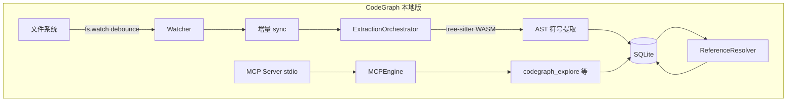
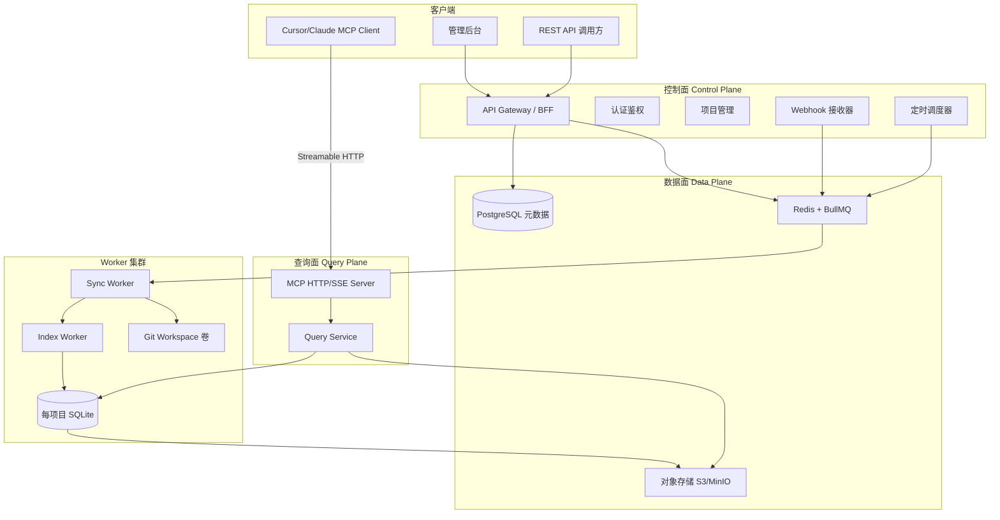
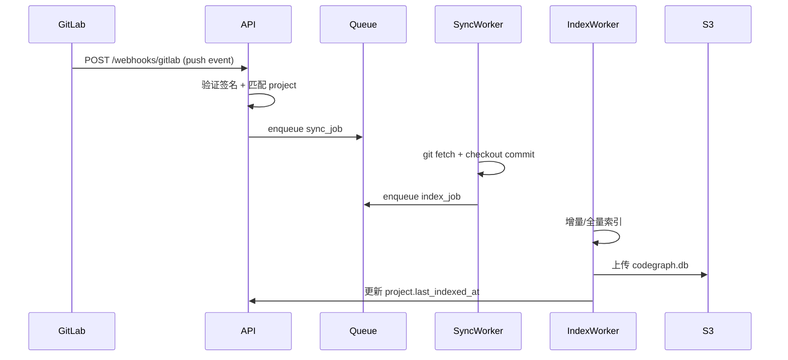
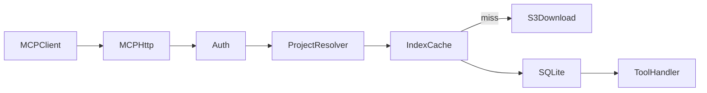

# CodeGraph Cloud 架构设计方案

## 一、CodeGraph 参考项目分析

### 1.1 技术栈

| 层级 | 技术选型 |
|------|----------|
| 运行时 | Node.js 20+（CLI 自带 bundle；库模式需 22.5+ 的 `node:sqlite`） |
| 语言 | TypeScript |
| 解析 | tree-sitter（WASM grammars，20+ 语言） |
| 存储 | SQLite + FTS5（每项目 `.codegraph/codegraph.db`） |
| MCP | 自研 JSON-RPC 2.0（stdio + Unix socket daemon） |
| 文件监听 | `fs.watch`（FSEvents/inotify/ReadDirectoryChangesW） |
| 测试 | Vitest |

### 1.2 核心数据流



### 1.3 模块职责（[`/Users/dezliu/Documents/mine/repo/codegraph/src`](file:///Users/dezliu/Documents/mine/repo/codegraph/src)）

- **extraction/** — 文件扫描、tree-sitter 解析、Worker 池并行、增量 hash 比对
- **resolution/** — 跨文件引用解析（import、call、extends）、17 个框架路由识别
- **graph/** — 图遍历（callers/callees/impact）
- **context/** — 自然语言查询 → FTS + 图遍历 → 组装 markdown 上下文
- **db/** — SQLite schema（`nodes`/`edges`/`files`/`nodes_fts`），见 [`schema.sql`](file:///Users/dezliu/Documents/mine/repo/codegraph/src/db/schema.sql)
- **sync/** — FileWatcher + git hooks + worktree 检测
- **mcp/** — Daemon 共享进程、ToolHandler、`codegraph_explore` 单工具策略

### 1.4 关键设计模式（值得借鉴）

1. **三阶段管道**：Extract → Store → Resolve（解析与解析分离，支持全量/增量）
2. **每项目独立 SQLite**：WAL 模式，读写并发友好
3. **MCP 单工具策略**：默认只暴露 `explore`，减少 Agent 误用
4. **Stale 感知**：索引滞后时返回 banner，引导 Agent 直接 Read
5. **Daemon 共享**：多 MCP 会话共享一个 watcher + DB 连接

### 1.5 本地版的局限（云端需解决）

- 索引绑定本地文件系统，无法远程查询
- MCP 仅 stdio/socket，无法跨网络
- 无多租户、无项目配置、无 Git 集成
- 无任务队列，大仓库索引阻塞进程

---

## 二、CodeGraph Cloud 目标架构

### 2.1 总体架构



### 2.2 与本地版的核心差异

| 维度 | CodeGraph 本地 | CodeGraph Cloud |
|------|---------------|-----------------|
| 代码来源 | 本地工作区 | Git clone/pull |
| 变更感知 | fs.watch | Webhook + 可配置轮询 |
| 索引触发 | 实时 debounce | 任务队列异步 |
| MCP 传输 | stdio | HTTP Streamable MCP |
| 存储 | 本地 `.codegraph/` | 对象存储 + 本地缓存 |
| 多租户 | 无 | 组织/项目/API Key |

---

## 三、推荐技术栈

### 3.1 后端（Monorepo，pnpm workspace）

| 组件 | 推荐 | 理由 |
|------|------|------|
| 语言 | **TypeScript** | 与 tree-sitter 生态一致，团队可复用 codegraph 设计经验 |
| API 框架 | **Hono** 或 **Fastify** | 轻量、性能好、适合 MCP HTTP 挂载 |
| 元数据库 | **PostgreSQL** | 项目配置、用户、同步状态、审计日志 |
| 任务队列 | **BullMQ + Redis** | Webhook/轮询/索引任务解耦、重试、优先级 |
| Git 操作 | **isomorphic-git** 或 **simple-git** | Worker 内 clone/fetch/checkout |
| 解析引擎 | **tree-sitter + web-tree-sitter** | 与参考项目相同技术路线，自研提取/解析层 |
| 索引存储 | **better-sqlite3** 或 **node:sqlite** | 每项目一个 DB，schema 借鉴 codegraph |
| 对象存储 | **MinIO（开发）/ S3（生产）** | 持久化 SQLite 索引 + git mirror |
| MCP SDK | **@modelcontextprotocol/sdk** | 官方 Streamable HTTP 传输 |

### 3.2 管理后台

| 组件 | 推荐 |
|------|------|
| 框架 | **Next.js 15（App Router）** 或 **React + Vite** |
| UI | **shadcn/ui + Tailwind** |
| 状态 | TanStack Query |
| 认证 | NextAuth / 自建 JWT + API Key |

### 3.3 基础设施

- **Docker Compose**（本地开发）：API + Worker + Redis + Postgres + MinIO
- **生产**：K8s 或 Docker Swarm；Worker 水平扩展
- **GitLab 集成**：System Hook / Project Webhook → `POST /webhooks/gitlab`

---

## 四、Monorepo 代码结构

```
codegraph-cloud/
├── apps/
│   ├── api/                    # 控制面 API + Webhook 接收
│   │   ├── src/
│   │   │   ├── routes/         # projects, sync, webhooks, api-keys
│   │   │   ├── services/
│   │   │   └── index.ts
│   │   └── package.json
│   ├── mcp-server/             # 对外 MCP HTTP 服务
│   │   ├── src/
│   │   │   ├── transport/      # Streamable HTTP
│   │   │   ├── tools/          # explore, search, callers...
│   │   │   └── index.ts
│   │   └── package.json
│   ├── worker/                 # Sync + Index Worker
│   │   ├── src/
│   │   │   ├── jobs/           # sync-repo, index-project, incremental-sync
│   │   │   ├── git/            # clone, fetch, checkout
│   │   │   └── index.ts
│   │   └── package.json
│   └── admin/                  # 管理后台 Next.js
│       ├── app/
│       │   ├── projects/         # 项目列表/配置/同步状态
│       │   ├── settings/
│       │   └── layout.tsx
│       └── package.json
├── packages/
│   ├── core/                   # 自研索引引擎（借鉴 codegraph 设计）
│   │   ├── extraction/         # tree-sitter 提取
│   │   ├── resolution/         # 跨文件解析
│   │   ├── graph/              # 图遍历
│   │   ├── context/            # explore 上下文组装
│   │   ├── db/                 # SQLite schema + queries
│   │   └── index.ts
│   ├── shared/                 # 类型、常量、工具
│   └── db-schema/              # Prisma/Drizzle PostgreSQL schema
├── docker-compose.yml
├── pnpm-workspace.yaml
└── README.md
```

---

## 五、核心领域模型（PostgreSQL）

```sql
-- 组织与项目
organizations (id, name, created_at)
projects (id, org_id, name, repo_url, default_branch, 
          git_provider, credentials_ref, 
          poll_interval_sec, poll_enabled,
          index_config JSONB,  -- exclude/include/extensions
          status, last_synced_at, last_indexed_at)
api_keys (id, org_id, key_hash, scopes, expires_at)

-- 同步与索引任务
sync_jobs (id, project_id, trigger, status, 
           commit_sha, started_at, finished_at, error)
index_jobs (id, project_id, sync_job_id, status,
            files_total, files_indexed, db_path, error)

-- Webhook 去重
webhook_events (id, project_id, delivery_id, payload_hash, processed_at)
```

**索引产物**：`s3://indexes/{project_id}/{commit_sha}/codegraph.db`

---

## 六、同步与索引流程

### 6.1 Webhook 触发（主路径）



### 6.2 轮询兜底（可配置间隔）

- Scheduler（cron 或 BullMQ repeatable job）扫描 `poll_enabled=true` 的项目
- 比较 `git ls-remote` 与 `last_synced_commit`
- 有新区间则入队 sync_job（与 Webhook 共用同一 pipeline）
- 管理后台可配置 `poll_interval_sec`（如 300s / 3600s / 禁用）

### 6.3 增量索引策略（借鉴 codegraph sync）

1. **Reconcile 阶段**：对比 `files` 表的 `content_hash` 与磁盘 `stat + hash`
2. **删除**：DB 中多余文件 → 级联删除 nodes/edges
3. **新增/修改**：重新 parse + store + resolve（仅变更文件）
4. **大变更阈值**：变更文件 > 30% 时降级为全量索引

---

## 七、自研索引引擎（packages/core）设计

> 你选择自研而非直接依赖 codegraph 库。建议**借鉴其 schema 与管道设计**，分阶段实现语言支持。

### 7.1 MVP 语言范围（第一期）

- **TypeScript/JavaScript**（最大需求）
- **Python**
- **Go**

第二期再扩展 Java、Rust、PHP 等。

### 7.2 核心接口（对标 codegraph `CodeGraph` class）

```typescript
// packages/core/index.ts
export class CodeGraphEngine {
  static async open(projectRoot: string, dbPath: string): Promise<CodeGraphEngine>
  async indexAll(opts?: IndexOptions): Promise<IndexResult>
  async sync(opts?: SyncOptions): Promise<SyncResult>
  searchNodes(query: string, opts?: SearchOptions): SearchResult[]
  explore(query: string, opts?: ExploreOptions): ExploreResult
  getCallers(nodeId: string): Node[]
  getCallees(nodeId: string): Node[]
  getImpactRadius(nodeId: string, depth: number): Subgraph
  close(): void
}
```

### 7.3 SQLite Schema（沿用 codegraph 核心表）

直接参考 [`schema.sql`](file:///Users/dezliu/Documents/mine/repo/codegraph/src/db/schema.sql) 的 `nodes`、`edges`、`files`、`unresolved_refs`、`nodes_fts` 结构，降低查询层迁移成本。

### 7.4 解析 Worker 池

- 借鉴 codegraph 的 `parse-pool.ts`：主线程调度，Worker 线程跑 tree-sitter WASM
- 单文件超时 10s，每 250 文件回收 Worker（防 WASM 内存泄漏）

---

## 八、MCP 对外服务设计

### 8.1 传输协议

采用 MCP 2025-06 规范的 **Streamable HTTP**（非 stdio）：

```
POST /mcp                    # 初始化 + 工具调用
GET  /mcp/sse                # SSE 事件流（可选）
Authorization: Bearer <api_key>
X-Project-Id: <project_id>   # 或 URL path: /mcp/:projectId
```

### 8.2 工具集（第一期对齐 codegraph）

| 工具 | 用途 | 优先级 |
|------|------|--------|
| `codegraph_explore` | 一站式探索（主工具） | P0 |
| `codegraph_search` | 符号搜索 | P1 |
| `codegraph_callers` | 调用方 | P1 |
| `codegraph_callees` | 被调用方 | P1 |
| `codegraph_impact` | 影响分析 | P1 |
| `codegraph_status` | 索引状态/滞后信息 | P0 |

### 8.3 Server Instructions

复用 codegraph 的 Agent 引导策略（[`server-instructions.ts`](file:///Users/dezliu/Documents/mine/repo/codegraph/src/mcp/server-instructions.ts) 的核心思想）：

- 默认只列 `explore`
- 索引未就绪时返回引导文本（非 isError）
- 显示 `last_indexed_at` 和 commit SHA 作为 staleness 信号

### 8.4 查询路径



- MCP Server 维护 LRU 缓存（热项目 SQLite 本地挂载）
- 冷启动从 S3 拉取最新 `codegraph.db`（约秒级）

---

## 九、管理后台功能

### 9.1 项目配置页

- 仓库 URL、分支、Git 凭证（加密存储）
- Webhook 自动注册（GitLab API）或手动展示 Webhook URL + Secret
- 轮询间隔开关与秒数
- 索引配置：`exclude`/`include`/`extensions`（对标 [`codegraph.json`](file:///Users/dezliu/Documents/mine/repo/codegraph/README.md)）
- 手动触发「立即同步 + 索引」

### 9.2 监控面板

- 最近同步/索引任务状态
- 文件数、符号数、索引耗时
- 当前 commit SHA vs 远端 HEAD
- MCP 连接数 / 查询 QPS（可选）

### 9.3 API Key 管理

- 创建/吊销 Key
- 绑定组织或单项目 scope
- 供 Cursor MCP 配置使用

---

## 十、分阶段实施路线

### Phase 1 — 骨架（2-3 周）

- Monorepo 脚手架 + Docker Compose
- PostgreSQL schema + 项目 CRUD API
- Git clone Worker（仅 pull，无索引）
- 管理后台：项目创建/列表

### Phase 2 — 索引引擎 MVP（3-4 周）

- `packages/core`：TS/JS 提取 + SQLite 存储 + FTS
- Index Worker 全量索引
- S3 持久化索引文件

### Phase 3 — 同步闭环（2 周）

- GitLab Webhook 接收 + 签名验证
- 轮询 Scheduler（可配置间隔）
- 增量索引

### Phase 4 — MCP 服务（2 周）

- Streamable HTTP MCP Server
- `codegraph_explore` + `codegraph_status`
- API Key 认证
- Cursor MCP 配置文档

### Phase 5 — 增强（持续）

- 更多语言（Python、Go、Java...）
- 跨文件 resolution + 框架路由
- `callers`/`callees`/`impact` 工具
- 多租户计费、审计日志

---

## 十一、关键风险与缓解

| 风险 | 缓解 |
|------|------|
| 自研索引引擎工作量巨大 | MVP 仅 3 语言；schema/管道设计直接借鉴 codegraph |
| 大仓库索引耗时 | Worker 水平扩展；增量索引；变更阈值降级全量 |
| MCP 远程延迟 | 索引文件本地缓存；SQLite WAL 只读连接 |
| Git 凭证安全 | 加密存储（Vault/KMS）；Worker 临时解密 |
| 索引与代码版本不一致 | 每次查询返回 `indexed_commit`；Webhook 优先 |

---

## 十二、Cursor MCP 配置示例（目标态）

```json
{
  "mcpServers": {
    "codegraph-cloud": {
      "url": "https://api.your-domain.com/mcp",
      "headers": {
        "Authorization": "Bearer cgk_xxx",
        "X-Project-Id": "proj_abc123"
      }
    }
  }
}
```

---

## 十三、待后续确认的细节

1. **Git 提供商优先级**：GitLab 优先（工作区规则已指向 GitLab）还是同时支持 GitHub？
2. **部署环境**：自建 K8s / 单机 Docker / 云托管（Railway/Fly.io）？
3. **认证方式**：仅 API Key，还是需要 OAuth 登录管理后台？
4. **索引引擎第一期语言**：确认 TS/JS + Python + Go 是否满足初期需求？
